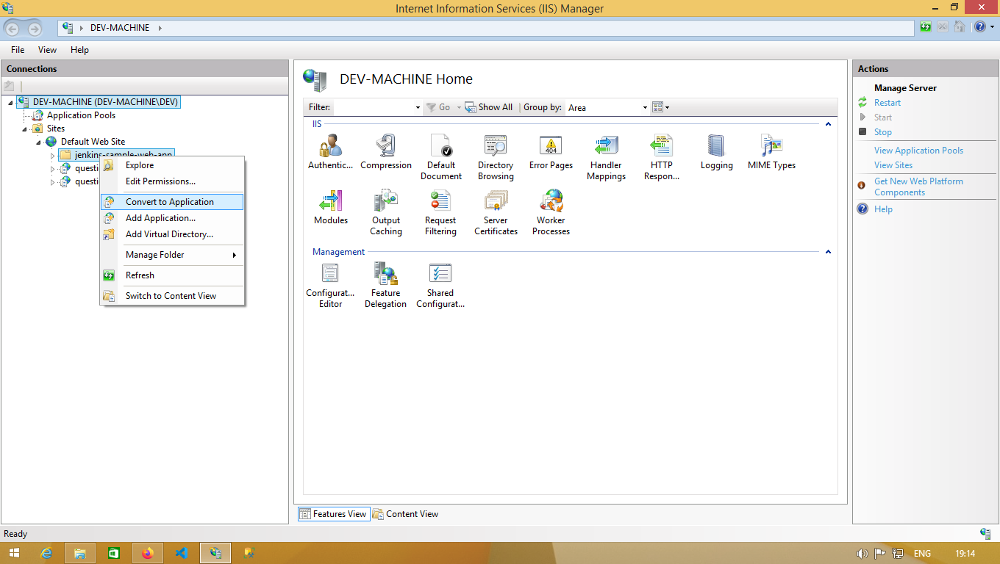

# jenkins-sample
Jenkins sample pipeline

## Prerequirements

### Install Jenkins on Windows:
- [JRE (Java Runtime Environment)](https://www.java.com/pt-BR/download/)
- [Git](https://git-scm.com/downloads)
- [Jenkins](https://www.jenkins.io/download/)

### Run .NET Core 3.1 on IIS:
- [Host ASP.NET Core on Windows with IIS](https://docs.microsoft.com/en-us/aspnet/core/host-and-deploy/iis/?view=aspnetcore-3.1)
- [ASP.NET Core 3.1 Runtime (v3.1.8) - Windows Hosting Bundle Installer](https://dotnet.microsoft.com/download/dotnet-core/thank-you/runtime-aspnetcore-3.1.8-windows-hosting-bundle-installer)
- [ASP.NET Core 3.1 Runtime (v3.1.8) - Windows x64 Installer](https://dotnet.microsoft.com/download/dotnet-core/thank-you/runtime-aspnetcore-3.1.8-windows-x64-installer)

## IIS Configuration

### Create web app folder in wwwroot folder

### Convert to application on IIS

### Edit the permissions

### Give full control to IIS_IUSRS

### Add the IUSR user

### Give full control to IUSR

